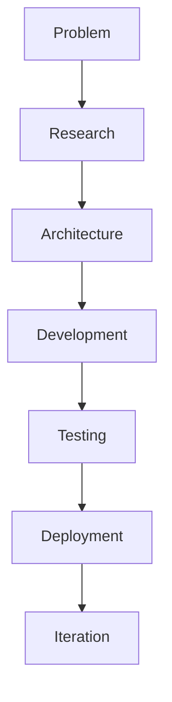

<p align="center">
  
</p>

<h1 align="center">👋 Hi — I’m Rishabh Patel</h1>
<h3 align="center">Full‑Stack Developer · AI & Automation Builder</h3>

<p align="center">
Building production-minded full‑stack applications, practical AI tools, and automation systems with a focus on clean architecture and user-centered UI/UX.
</p>

<p align="center">
  <a href="https://github.com/rishipatel186">GitHub</a> •
  <a href="https://www.linkedin.com/in/rishabh-patel-984637372/">LinkedIn</a> •
  <a href="https://github.com/rishipatel186/portfilio">Portfolio</a> •
  Email: patel.rishi.07186@gamil.com
</p>

<p align="center">
  
</p>

---

<!-- Quick identity cards -->
<table align="center" width="90%">
  <tr align="center">
    <td width="25%">💻<br/><strong>Full‑Stack Development</strong></td>
    <td width="25%">🤖<br/><strong>AI &amp; Automation</strong></td>
    <td width="25%">🧠<br/><strong>Problem Solving</strong></td>
    <td width="25%">🚀<br/><strong>Project Building</strong></td>
  </tr>
</table>

<p align="center">
  
</p>

## 🚀 Currently Building
Practical projects I actively focus on — repositories linked when public.

- 🤖 Ultron — AI Assistant (WIP) — Desktop assistant prototype (voice + automation). Repo: private / in progress.  
- 🎬 CineVerse — MERN OTT Platform — Repo: [OTT-PLATFORM](https://github.com/rishipatel186/OTT-PLATFORM) (work in progress).  
- 🏋️ Prime Fitness — Frontend + full‑stack fitness UI & template — Repo: [prime-fitness](https://github.com/rishipatel186/prime-fitness).

<p align="center">
  
</p>

## 🔥 Featured Projects
A compact, recruiter-friendly snapshot of priority work with short README excerpts and demo placeholders.

<table width="100%">
  <tr>
    <td valign="top" width="48%">

**🤖 Ultron — AI Assistant**  
- Short: Desktop‑focused assistant prototype (voice + automation).  
- Tech direction: JavaScript, Node.js, LLM integrations.  
- Repo: private / WIP — Demo: coming soon.

**README excerpt**
```
# Ultron AI Assistant
(Repository is currently private or in early development.)
```

    </td>
    <td valign="top" width="4%"></td>
    <td valign="top" width="48%">

**🎬 CineVerse / OTT‑Platform**  
- Short: MERN streaming platform (auth, discovery, watchlists).  
- Repo: [OTT-PLATFORM](https://github.com/rishipatel186/OTT-PLATFORM) — Demo: coming soon.

**README excerpt**
```
# OTT-PLATFORM
```

    </td>
  </tr>

  <tr><td colspan="3">&nbsp;</td></tr>

  <tr>
    <td valign="top" width="48%">

**🏋️ Prime Fitness**  
- Short: Fitness UI & experience — modern frontend patterns.  
- Repo: [prime-fitness](https://github.com/rishipatel186/prime-fitness) — Demo: see repo.

**README excerpt**
```
# Wixstro - Wix Astro Template

A modern, full-featured Wix Astro template built with React, TypeScript, and Tailwind CSS...
```

    </td>
    <td valign="top" width="4%"></td>
    <td valign="top" width="48%">

**🔧 Portfolio / Template (portfilio)**  
- Short: React + TypeScript + Vite starter / portfolio template.  
- Repo: [portfilio](https://github.com/rishipatel186/portfilio) — Demo: coming soon.

**README excerpt**
```
# React + TypeScript + Vite
This template provides a minimal setup to get React working in Vite with HMR and some ESLint rules.
```

    </td>
  </tr>
</table>

<p align="center">
  
</p>

## 🛠️ Tech Stack
A concise, recruiter-friendly summary.

### Languages
JavaScript · TypeScript · Java (learning) · Python (learning) · HTML · CSS

### Frontend
React · Tailwind CSS

### Backend
Node.js · Express.js · REST APIs

### Database
MongoDB · SQL (basic)

### Tools
Git · GitHub · VS Code

### AI / Automation
LLM integrations · Voice interfaces · Automation workflows

---

## 🏗️ My Development Workflow
I follow a repeatable process from problem to production.



---

## 🧠 Engineering Focus
- Full‑stack architecture  
- REST API design  
- Authentication  
- Database design  
- Responsive interfaces & UI/UX  
- AI integration & automation  
- Testing & CI  
- Git workflows & code reviews  
- Deployment & monitoring  
- Documentation

---

## 📚 Currently Learning
- Advanced JavaScript & modern patterns  
- MERN architecture & backend engineering  
- System design fundamentals  
- Testing & CI  
- AI application development  
- Data structures & algorithms

---

## 📈 GitHub Activity
Building consistently and learning in public. See my profile and repositories:

- Profile: https://github.com/rishipatel186
- Repositories: https://github.com/rishipatel186?tab=repositories

<p align="center">
  
</p>
