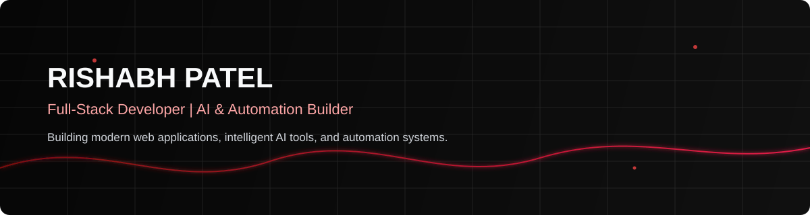
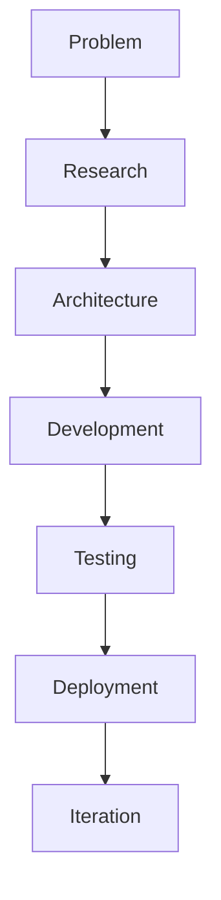
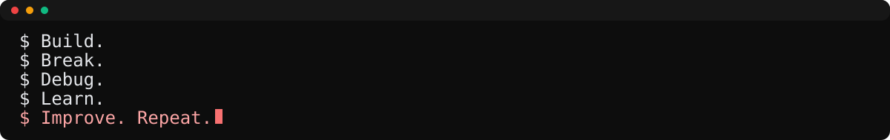

  

<h1 align="center">👋 Hi, I'm Rishabh Patel</h1>
<h3 align="center">Full-Stack Developer | AI &amp; Automation Builder</h3>

Building practical full‑stack applications, AI‑powered tools, and automation systems that solve real problems — focused on clean architecture, measurable results, and continual improvement.

  <a href="https://github.com/rishipatel186">GitHub</a>
  • <a href="https://github.com/rishipatel186/portfilio">Portfolio</a>
  • <a href="https://rishipatel186.github.io">Website</a>

  

---

<!-- Quick identity cards -->

<table align="center" width="90%">
  <tr align="center">
    <td width="25%">💻 <strong>Full‑Stack Development</strong></td>
    <td width="25%">🤖 <strong>AI &amp; Automation</strong></td>
    <td width="25%">🧠 <strong>Problem Solving</strong></td>
    <td width="25%">🚀 <strong>Project Building</strong></td>
  </tr>
</table>

  

## 🚀 Currently Building

Below are the major projects I'm focusing on right now. Where a repository exists, I've linked it — otherwise the item is a work in progress.

### 🤖 Ultron — AI Assistant (WIP)
Focused on a lightweight desktop assistant prototype that ties voice input, automation flows, and AI reasoning together for everyday productivity. (Repository: private / in progress)

### 🎓 Campus Brain — Academic Productivity (WIP)
An intelligent campus platform concept for student workflows, notes, and AI‑assisted helpers. Currently in planning and early development.

### 🎬 CineVerse — MERN OTT Platform
A MERN‑based streaming platform direction. Repository: [OTT-PLATFORM](https://github.com/rishipatel186/OTT-PLATFORM) — work in progress.

### 🏋️ Prime Fitness
A modern frontend + full‑stack fitness project. Repository: [prime-fitness](https://github.com/rishipatel186/prime-fitness)

  

## 🔥 Featured Projects

<table width="100%">
  <tr>
    <td valign="top" width="48%">

**🤖 Ultron — AI Assistant**

- Short: Desktop‑focused assistant prototype (voice + automation).
- Focus: Voice interfaces, command execution, automation flows.
- Tech (direction): JavaScript, Node.js, LLM integrations

    </td>
    <td valign="top" width="4%"></td>
    <td valign="top" width="48%">

**🎓 Campus Brain**

- Short: Campus productivity & workflows (AI helpers).
- Focus: Student workflows, notes, lightweight integrations.
- Tech (direction): MERN, REST APIs, AI integrations

    </td>
  </tr>
  <tr><td colspan="3">&nbsp;</td></tr>
  <tr>
    <td valign="top" width="48%">

**🎬 CineVerse / OTT‑Platform**

- Short: MERN streaming platform direction — auth, discovery, watchlists.
- Repo: [OTT-PLATFORM](https://github.com/rishipatel186/OTT-PLATFORM)
- Tech: React, Node.js, Express, MongoDB

    </td>
    <td valign="top" width="4%"></td>
    <td valign="top" width="48%">

**🏋️ Prime Fitness**

- Short: Fitness UI & experience — modern frontend patterns.
- Repo: [prime-fitness](https://github.com/rishipatel186/prime-fitness)
- Tech: TypeScript, React, Tailwind CSS

    </td>
  </tr>
</table>

  

## 🛠️ Tech Stack

A focused, recruiter‑friendly view of the tools and languages I use.

### Languages
- JavaScript • TypeScript • Java (learning) • Python (learning) • HTML • CSS

### Frontend
- React • Tailwind CSS

### Backend
- Node.js • Express.js • REST APIs

### Database
- MongoDB • SQL (basic)

### Tools
- Git • GitHub • VS Code

### AI / Automation
- LLM integrations • Voice interfaces • Automation workflows

## 🏗️ My Development Workflow

I design systems with maintainability in mind: clear APIs, layered architecture, tests, and repeatable deployments.

## 🧠 Engineering Focus

- Full‑stack architecture
- REST API design
- Authentication
- Database design
- Responsive interfaces
- AI integration & automation
- Testing & CI
- Git workflows & code reviews
- Deployment & monitoring
- Documentation

## 📚 Currently Learning

- Advanced JavaScript & modern patterns
- MERN architecture & backend engineering
- System design fundamentals
- Testing & CI
- AI application development
- Data structures & algorithms

## 📈 GitHub Activity

Building consistently and learning in public. See my repositories and contributions on my profile:

- GitHub: https://github.com/rishipatel186
- Repositories: https://github.com/rishipatel186?tab=repositories

## 🛠️ What I'm Working Toward

- Production‑quality projects
- Open‑source contributions
- Strong backend engineering
- AI‑powered applications
- Better system design and architecture

## 🌐 Connect with Me

- GitHub — https://github.com/rishipatel186
- Portfolio — https://github.com/rishipatel186/portfilio
- Website — https://rishipatel186.github.io

  

Designed to be concise, dark‑themed, and recruiter‑focused — Full‑Stack + AI/Automation.

