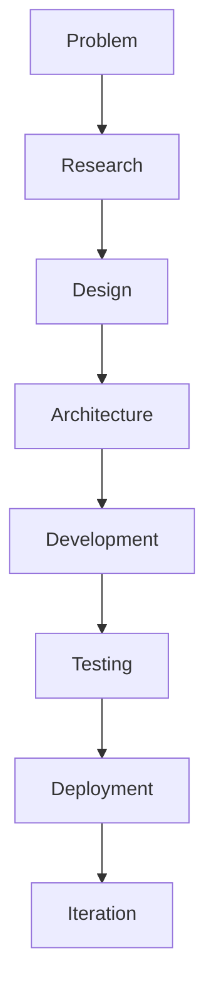

  

# 👋 Hi, I'm Rishabh Patel
### Full-Stack Developer | AI & Automation Builder

Building modern web applications, intelligent AI tools, and automation systems focused on real-world problem solving.

  <a href="https://github.com/rishipatel186">GitHub</a> •
  <a>LinkedIn</a> •
  <a href="https://github.com/rishipatel186/portfolio">Portfolio Repository</a> •
  <a>Email</a>

  

  

## 🚀 Currently Building

### 🤖 Ultron AI Assistant
AI-powered desktop assistant focused on voice interaction, AI reasoning, and computer automation.

### 🎓 Campus Brain
AI-powered campus platform designed to unify student, teacher, and administrative workflows.

### 🎬 CineVerse
Full-stack OTT streaming platform built with the MERN stack.

## 🔥 Featured Projects

### 🤖 Ultron AI Assistant
Voice-controlled desktop assistant for natural-language interaction and automated computer tasks.  
**Tech:** JavaScript, AI integrations, Voice interfaces, Automation  
**Links:** <a>Repository</a> (placeholder) • <a>Live Demo</a> (placeholder) • <a>Demo Video</a> (placeholder)

### 🎓 Campus Brain
Intelligent campus platform for productivity, academic operations, and AI-assisted workflows.  
**Tech:** MERN Stack, REST APIs, MongoDB, AI integrations  
**Links:** <a>Repository</a> (placeholder) • <a>Live Demo</a> (placeholder) • <a>Demo Video</a> (placeholder)

### 🎬 CineVerse
MERN OTT platform focused on authentication, content discovery, search, and watchlist-ready UX.  
**Tech:** React, Node.js, Express.js, MongoDB  
**Links:** <a>Repository</a> (placeholder) • <a>Live Demo</a> (placeholder) • <a>Demo Video</a> (placeholder)

### 🏋️ Prime Fitness
Fitness-focused project with modern frontend tooling and full-stack development direction.  
**Tech:** TypeScript, React, Tailwind CSS  
**Links:** [Repository](https://github.com/rishipatel186/prime-fitness) • <a>Live Demo</a> (placeholder) • <a>Demo Video</a> (placeholder)

## 🛠️ Tech Stack

### Languages

### Frontend

### Backend

### Database

### Tools

### AI / Automation

## 🏗️ How I Build

Focused on clean architecture, API design, database design, authentication, responsive UI, testing, documentation, and continuous improvement.

## 📊 GitHub Analytics

- [GitHub Profile Overview](https://github.com/rishipatel186)
- [Repositories](https://github.com/rishipatel186?tab=repositories)
- [Contribution Activity](https://github.com/rishipatel186)

## 🧠 Currently Learning

- Advanced JavaScript
- MERN architecture
- Backend engineering
- REST API design
- Git & GitHub workflows
- Testing
- AI integration
- AI agents
- System design fundamentals
- Data Structures & Algorithms

## 🌱 Open Source

Exploring open-source projects, contributing where I can, and learning from the wider developer community.

## 📈 Development Philosophy

  

## 🌐 Connect With Me

- GitHub: [rishipatel186](https://github.com/rishipatel186)
- LinkedIn: <a>LinkedIn</a>
- Portfolio: [Portfolio Repository](https://github.com/rishipatel186/portfolio)
- Email: <a>Email</a>

  Designed for clarity, built for impact — Full-Stack + AI/Automation direction.

